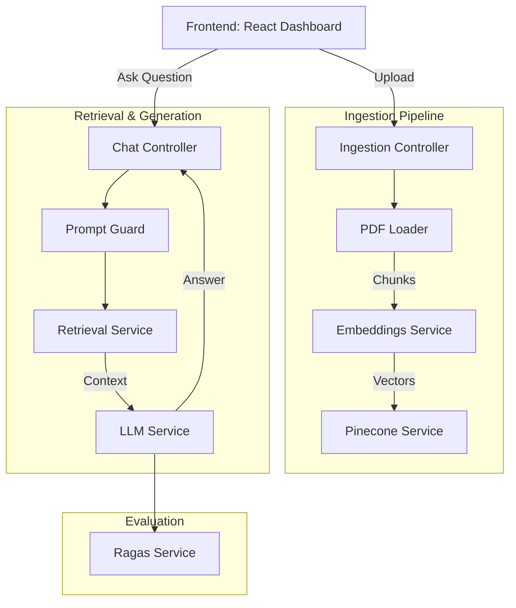

# AI Document Assistant (RAG System)

A production-grade **Retrieval-Augmented Generation (RAG)** system built with modern technologies. This application allows users to upload PDF/TXT documents and engage in context-aware conversations powered by Large Language Models (LLMs) and semantic search.


---

## 🚀 Key Features

- **Intelligent Document Ingestion**: Seamlessly upload and process PDF/TXT files with automated text extraction and recursive character splitting.
- **Semantic Vector Search**: High-performance retrieval using OpenAI embeddings and Pinecone vector database.
- **Grounded LLM Responses**: Context-aware Q&A using OpenAI models with strict instructions to prevent hallucinations.
- **Security & Guardrails**: Built-in protection against prompt injection attacks (e.g., "ignore previous instructions").
- **Observability & Tracing**: Integrated with LangSmith for full lifecycle tracing of LLM calls.
- **Automated Evaluation**: RAGAS-style evaluation service to measure faithfulness, relevance, and correctness.
- **Premium UI/UX**: Modern dark-themed dashboard with glassmorphism aesthetics, drag-and-drop support, and smooth animations.

---

## 🛠️ Tech Stack

### Backend (NestJS)
- **Framework**: [NestJS](https://nestjs.com/) (Node.js)
- **AI Orchestration**: [LangChain](https://js.langchain.com/)
- **LLM / Embeddings**: [OpenAI](https://openai.com/)
- **Vector Database**: [Pinecone](https://www.pinecone.io/)
- **Config Management**: Typed NestJS namespaces (`registerAs`)
- **File Handling**: Multer

### Frontend (React)
- **Framework**: [Vite](https://vitejs.dev/) + [React](https://reactjs.org/) (TypeScript)
- **Styling**: [Tailwind CSS](https://tailwindcss.com/)
- **Icons**: [Lucide React](https://lucide.dev/)
- **Animations**: [Framer Motion](https://www.framer.com/motion/)
- **API Client**: Axios

---

## 🏗️ Architecture



---

## 🚦 Getting Started

### Prerequisites
- Node.js (v18+)
- OpenAI API Key
- Pinecone API Key & Index

### 1. Backend Setup
```bash
cd backend
npm install
```
Create a `.env` file in the `backend/` directory:
```env
OPENAI_API_KEY=your_openai_key
PINECONE_API_KEY=your_pinecone_key
PINECONE_INDEX_NAME=your_index_name
# Optional: LangSmith Tracing
LANGCHAIN_TRACING_V2=true
LANGCHAIN_API_KEY=your_langsmith_key
```
Run the server:
```bash
npm run start:dev
```

### 2. Frontend Setup
```bash
cd frontend
npm install
npm run dev
```

---

## 🛡️ Security Guardrails
The system includes a `GuardrailsModule` that monitors incoming user queries. It identifies and blocks common prompt injection patterns, ensuring the LLM remains within its designated safety boundaries.

---

## 📈 Observability & Evaluation
- **Tracing**: Every LangChain call is auto-instrumented for LangSmith.
- **Evaluation**: The `RagasService` provides automated scoring for:
    - **Context Relevance**: How well the retrieved data fits the question.
    - **Faithfulness**: If the answer is purely derived from the context.
    - **Correctness**: Overall accuracy of the final response.

---
